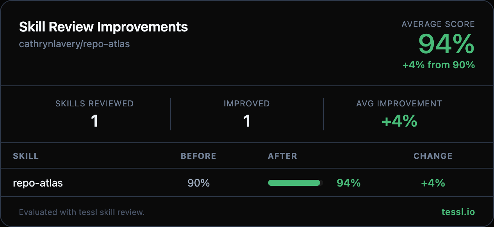

Hey @cathrynlavery 👋

I ran your skills through `tessl skill review` at work and found some targeted improvements. Here's the full before/after:

| Skill | Before | After | Change |
|-------|--------|-------|--------|
| repo-atlas | 90% | 94% | +4% |

Your skill was already in great shape at 90% — these are surgical tweaks to push it higher.

What changed

**Description (90% → 100%)**
- Added concrete sub-actions to the description: "generates directory maps with entrypoints, documents architecture and module boundaries, traces critical flows, catalogs external dependencies, and creates agent-ready onboarding guides"
- Used quoted string format for the description frontmatter instead of bare string

**Content conciseness improvements**
- **Phase 1**: Condensed the repo type identification list (app, backend/API, library, monorepo, CLI, infrastructure) into a single line — Claude already knows what these types look like, so the per-type explanations were redundant tokens
- **Phase 5**: Replaced the verbose 25-line inline CLAUDE.md template with a compact summary of the key structure (atlas pointer, two-agent workflow, working rules) — the detail was adding tokens without adding clarity since the template contents are straightforward

Net effect: 29 fewer lines, same information density, better token efficiency.

Honest disclosure — I work at @tesslio where we build tooling around skills like these. Not a pitch — just saw room for improvement and wanted to contribute.

Want to self-improve your skills? Just point your agent (Claude Code, Codex, etc.) at [this Tessl guide](https://docs.tessl.io/evaluate/optimize-a-skill-using-best-practices) and ask it to optimize your skill. Ping me — [@yogesh-tessl](https://github.com/yogesh-tessl) — if you hit any snags.

Thanks in advance 🙏
